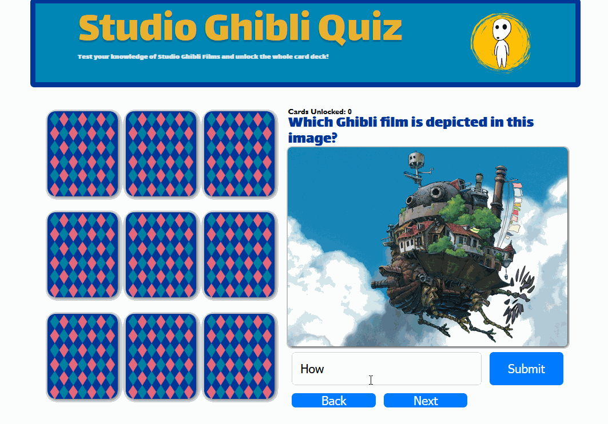

# Web Development Project 3 - *Studio Ghibli Quiz*

Submitted by: **Ahnaf Talukder**

This web app: **This is an interactive quiz for people to have fun while testing their knowledge of the famous Studio Ghibli films directed by Hayao Miyazaki. Some award winning titles include Spirited Away, My Neighbor Totoro, and more! The quiz is a game where the player has to unlock as many cards as possible and complete their Ghibli deck. **

Time spent: **10** hours spent in total

## Required Features

The following **required** functionality is completed:

- [X] **The user can enter their guess in a box before seeing the flipside of the card**
- [X] **Clicking on a submit button shows visual feedback about whether the answer was correct or incorrect**
- [X] **A back button is displayed on the card and can be used to return to the previous card in a set sequence**
- [X] **A next button is displayed on the card and can be used to navigate to the next card in a set sequence**

The following **optional** features are implemented:

- [ ] A shuffle button is used to randomize the order of the cards
- [X] A user's answer may be counted as correct even when it is slightly different from the target answer
- [X] A counter displays the user's current and longest streak of correct responses
- [ ] A user can mark a card that they have mastered and have it removed from the pool of answers as well as added to a list of mastered cards

The following **additional** features are implemented:

* [X] List anything else that you added to improve the site's functionality!

- Interactive card deck, card design pattern, image based form
  
      

## Video Walkthrough

Here's a walkthrough of implemented user stories:

Gif created using Licecap.

## Notes

I wanted to build something that was different from the ordinary Quizlet style, something more gamefied. I recently became fascinated by the diverse patterns that are on the fronts of many card-based games. That's why I wanted to create a game with some kind of card deck that a player must unlock. 

I designed it in Figma, which didn't take me very long since I had a clear idea of what I wanted. Afterwards, I quickly created the CSS layout and styling, which also didn't take that long. What I struggled with the most was impelementing the different states and interactive functionalties that would make everything work. After going through the recorded lecture a couple of times and reading the additonal material, I pieced together all the parts to meet the needs of my project.

# Images used in this project were taken from the official studio ghibli website: https://www.ghibli.jp/ and were only used for personal/educational purposes. 

## License

    Copyright [2023] [Ahnaf Talukder]

    Licensed under the Apache License, Version 2.0 (the "License");
    you may not use this file except in compliance with the License.
    You may obtain a copy of the License at

        http://www.apache.org/licenses/LICENSE-2.0

    Unless required by applicable law or agreed to in writing, software
    distributed under the License is distributed on an "AS IS" BASIS,
    WITHOUT WARRANTIES OR CONDITIONS OF ANY KIND, either express or implied.
    See the License for the specific language governing permissions and
    limitations under the License.
